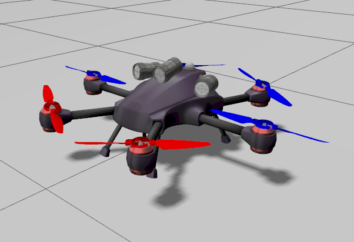

# Available Robots

This package is ready to work with 2 different UGV and 1 type of UAV in Gazebo Ignition. All robots were adapted to work properly within the simulations provided, this is due to the fact that the way they are published in Fuel might not be appropriate for out-of-the-box use, given that Gazebo Ignition and Rviz see the models and topics in a different way.

All robots were downloaded from [fuel](https://app.gazebosim.org/fuel/models). I've adapted them to work out-of-the-box with ROS 2 Jazzy Jalisco and Ignition Gazebo using ros-gazebo-bridge with parameterized namespaces, resources paths, and properly configuring the necessary topics to have full controll over them.

- [Available Robots](#available-robots)
  - [Transform trees and sensors](#transform-trees-and-sensors)
  - [Clearpath Husky](#clearpath-husky)
  - [X2 UGV](#x2-ugv)
  - [X4 UAV](#x4-uav)

## [Transform trees and sensors](#transform-trees-and-sensors-link)

The transformation tree is one important part of the system and it might break all your experiments if not properly configured. Unfortunately, ROS 2 has yet a long road to fix some inconsistencies regarding how the namespaces are handled by sensors and transforms defined via nodes and from the .sdf files that defines a robot. 

For the purpose of a better usability, in this project I've configured all robots with a transformation tree from a parameterized namespace assigned during launch. I've added a static transform for ground truth pose in a odom frame, which allows you to correctly use and visualize the 3D and 2D lidars, the 3D model, and robots' models in softwares like [RViz2](https://github.com/ros2/rviz), and makes them ready for experimentation in complex scenarios.

## [Clearpath Husky](#clearpath-husky-link)

I've configured the Husky robot with:

- IMU
- 3D Lidar
- 2D Lidar
- Odometry
- Ground truth pose

I've configured the transformation tree as follows.

I've provided a basic RViz file to visualize this robot, its transforms, and model.

## [X2 UGV](#x2-link)

I've configured the X2 UGV with:

- IMU
- 3D Lidar
- 2D Lidar
- Odometry
- Ground truth pose

I've configured the transformation tree as follows.

I've provided a basic RViz file to visualize this robot, its transforms, and model.

## [X4 UAV](#x4-link)

Differently, I've configured the X4 UAV with:

- IMU
- RGBD Camera
- Odometry
- Ground truth pose

I've configured the transformation tree as follows.

I've provided a basic RViz file to visualize this robot, its transforms, and model.

